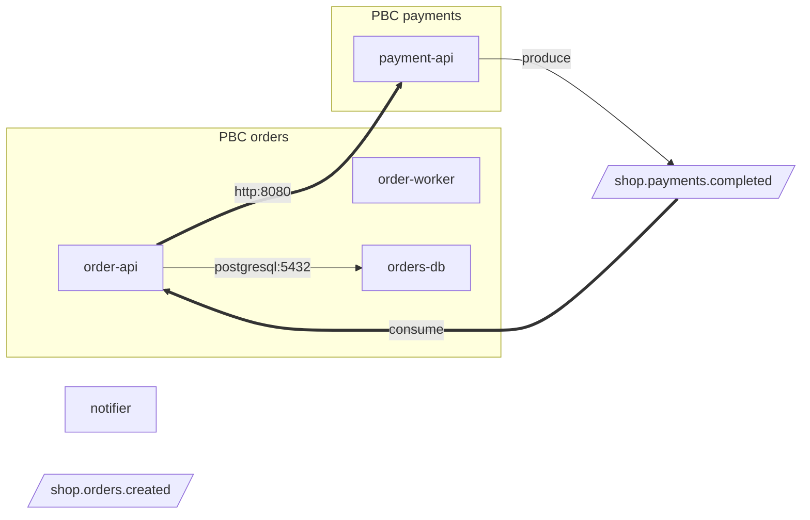

# EPIC-03: спецификация

Что делает эпик и как проверить результат. Как устроено — `design.md` (номера разделов ниже — его разделы).

## 1. Термины

| Термин | Значение в dhg |
|---|---|
| Сервис (service, микросервис) | группа ресурсов `generator.GroupResources` (`pkg/generator/grouping.go`): метки `app.kubernetes.io/name` → `app.kubernetes.io/instance` → `app` → `name`, затем компоненты связей, затем namespace. Единица chart'а в режимах separate/library/umbrella |
| Workload | объект с pod template: Deployment, StatefulSet, DaemonSet, ReplicaSet, Job, CronJob, Pod |
| PBC (Packaged Business Capability — упакованная бизнес-возможность) | набор сервисов, который поставляется и развивается вместе и даёт одну бизнес-функцию; в Kubernetes — значение метки `app.kubernetes.io/part-of` (или `--pbc-label`) либо явное соответствие `--pbc` |
| Продукт (product) | набор PBC одного запуска dhg; имя — `--chart-name` |
| Соединение (connection) | факт «workload обращается по сети к адресу» или «workload пишет/читает топик брокера»; `types.Connection` (design §3.4) |
| Логический узел (logical node) | цель соединения, которой нет среди объектов входа: внешний хост, IP, Service кластера вне входа, топик (design §3.3) |
| Доказательство (evidence) | где во входе найден факт: объект, поле, ключ, значение без секретов |
| Уверенность (confidence) | `high`/`medium`/`low` по правилам design §4.9 |
| Межграничное соединение (cross-PBC) | соединение, у которого PBC вызывающего и вызываемого различаются; сервис без PBC — свой собственный PBC |
| Асинхронный контракт | топик, с которым работают сервисы двух и более PBC |
| Брокер (broker) | адреса bootstrap servers (Kafka) или AMQP addresses; `Role: broker` |

## 2. Требования

### Соединения

- **R1.** Соединения хранятся в `ResourceGraph.Connections`, логические узлы — в `ResourceGraph.Nodes`. `ResourceGraph.Relationships`, `Groups`, `Orphans` и все chart'ы, сгенерированные без новых флагов и без `--with connection-policies`, не меняются ни на одном входе репозитория ни в одном режиме.
- **R2.** Источники фактов: `env[].value`; `env[].valueFrom.configMapKeyRef`/`secretKeyRef`; `envFrom[].configMapRef`/`secretRef` (с `prefix`); раскрытие `$(VAR)`; `-Dkey=value` из `JAVA_OPTS`, `JAVA_TOOL_OPTIONS`, `JDK_JAVA_OPTIONS`; `--key=value` из `command`/`args`; `SPRING_APPLICATION_JSON`; файлы `application*.{yml,yaml,properties}`, `bootstrap.{yml,yaml,properties}` из смонтированных ConfigMap (design §4.1).
- **R3.** Разбираются форматы: URL; JDBC (PostgreSQL multi-host, MySQL/MariaDB, Oracle thin в трёх формах, SQL Server); R2DBC и `vertx-reactive:`; списки `host:port` с Kafka listener-префиксами; MongoDB (`mongodb`, `mongodb+srv`); Redis (`redis`, `rediss`, списки узлов); AMQP; OIDC issuer (design §4.4).
- **R4.** Ключи классифицируются каталогом design §4.3: свойства Spring Boot, Spring Cloud, Quarkus, MicroProfile, Micronaut в форме свойства и в двух env-формах (MicroProfile и Spring relaxed binding), затем общие env-суффиксы; пары `*_HOST` + `*_PORT`.
- **R5.** Хост разрешается в Service входа (короткое имя, `name.ns`, `name.ns.svc`, `name.ns.svc.<cluster-domain>`, DNS pod'а за headless Service), в Service кластера вне входа, во внешний хост или IP; Service `ExternalName` — во внешний хост. Порт сопоставляется с `spec.ports[].port`; `targetPort` (число или имя) — в `TargetPort` (design §4.8).
- **R6.** Каждое соединение имеет уверенность по design §4.9 и не меньше одного доказательства.
- **R7.** Не создают соединений: плейсхолдеры без значения по умолчанию, нераскрытые `$(VAR)`, маскированные секреты (`REDACTED`), loopback, нелокальные схемы (`file:`, `classpath:`, `jdbc:h2:` …), неразбираемые значения, вызовы workload'ом собственного Service. Каждый такой случай — `Skip` с фиксированной причиной (design §4.5), кроме неклассифицированных ключей.
- **R8.** Никакой вывод dhg (граф, JSON, отчёт, `Note:`, values, шаблоны) не содержит значения из Secret и пароли из userinfo/query любых значений (`connect.Redact`).
- **R9.** Топики: Spring Cloud Stream (направление по имени binding'а и алиасам), SmallRye Reactive Messaging, `spring.kafka.template.default-topic`, общие `*_TOPIC` (без направления, `topic_use`); consumer group; брокер топика и `brokerID`; сопоставление с `KafkaTopic` входа (`kafka.strimzi.io/v1` и `v1beta2`) (design §4.6–4.7).
- **R10.** Вывод детерминирован: одинаковый вход даёт побайтно одинаковые граф, JSON, отчёт, шаблоны.
- **R11.** Обработка соединений линейна по числу фактов: 1000 workload'ов × 30 env — меньше 2 с (тест-ограничитель).

### PBC и продукт

- **R12.** PBC сервиса: явное `--pbc <pbc>=<svc>[,<svc>…]` → значение метки `--pbc-label` (по умолчанию `app.kubernetes.io/part-of`) у workload'ов группы (иначе у любых её ресурсов, самое частое) → без PBC. `--pbc-label ""` отключает метку. Конфликты — заметки (design §4.11).
- **R13.** Имя PBC из метки приводится к DNS-1123 label; изменение имени — заметка. Имя в `--pbc`, не являющееся DNS-1123 label, сервис из `--pbc`, которого нет во входе, сервис в двух PBC — ошибки до генерации.
- **R14.** Имя продукта = `--chart-name`.
- **R15.** `--mode umbrella --group-by pbc` строит вложенный umbrella «продукт → PBC → сервис» (design §4.12): `condition` и `global` работают на всех уровнях, сервисы без PBC — прямые subchart'ы продукта.
- **R16.** `--mode separate|library --group-by pbc` раскладывает chart'ы сервисов по каталогам `<pbc>/<svc>` (design §4.13).
- **R17.** `--mode universal --group-by pbc` не меняет chart; PBC влияет только на отчёт и `connection-policies`.
- **R18.** `--group-by service` (умолчание) — вывод как сейчас (R1).

### Граница PBC и выходы

- **R19.** Для каждого соединения определимы PBC вызывающего и вызываемого (для Service входа — PBC его группы; для логических узлов — нет PBC; для топика — `OwnerPBC` design §4.14). Соединение межграничное, если PBC различаются.
- **R20.** `dhg graph` показывает соединения и логические узлы; уровни `resource`, `service`, `pbc`; кластеры по PBC; форматы `dot`, `mermaid`, `json`, `report`.
- **R21.** Отчёт межPBC-контрактов (`PBC.md` при `generate --group-by pbc`, `dhg graph --format report`): PBC и их сервисы, синхронные межPBC-вызовы, асинхронные контракты (топики), внешние зависимости по PBC, Service кластера вне входа, сервисы без PBC, находки `low` и пропуски.
- **R22.** `--with connection-policies` создаёт по NetworkPolicy на workload с правилами из соединений ≥ `min-confidence`, по правилам design §4.15; ни одно направление, не выражаемое фактами, не закрывается по умолчанию.
- **R23.** `dhg generate` печатает одну строку `Note: connections: <n> (<h> high, <m> medium, <l> low), <s> values skipped; details: dhg graph --format report` при `n > 0` или `s > 0`; подробные заметки — при `-v`.
- **R24.** Вход масштаба продукта: несколько `-f` (каталоги нескольких репозиториев) — поддерживается сейчас и остаётся основным способом; дубликаты объектов — как сейчас (`extractor.Deduplicate`, предупреждение). Смешение источников разных типов в одном запуске не поддерживается (раздел 6). Повторяемый `--git-path` и `dhg graph -s cluster|gitops` — задача 16 (draft).
- **R25.** `--with istio-egress` получает хосты из `Connections` (`external-host`, кроме `Ambiguous`), включая env из ConfigMap/Secret и конфигурационных файлов.
- **R26.** (draft, задача 15) Синтетические источники (`-s source`) передают в граф соединения из свойств проекта, которые не копируются в env (топики, Feign-клиенты).

## 3. Входы

| Источник | Факт | Правило |
|---|---|---|
| `spec…containers[].env[]` (все виды workload'ов) | имя и значение переменной | design §4.1 п.1, каталог §4.3 |
| ConfigMap/Secret входа, на которые ссылаются `envFrom`/`valueFrom` | значения ключей | Secret: `stringData`, иначе base64 `data`; значения не выводятся |
| ConfigMap, смонтированный томом | файлы `application*.yml/.yaml/.properties`, `bootstrap.*` | design §4.1 п.2 |
| `command`, `args` | `--key=value` | только ключи каталога |
| env `JAVA_OPTS`, `JAVA_TOOL_OPTIONS`, `JDK_JAVA_OPTIONS` | `-Dkey=value` | ключи каталога и generic-правила свойств не применяются (только каталог) |
| env `SPRING_APPLICATION_JSON` | JSON-свойства | разворачивается в точечные ключи |
| Service | `spec.type`, `spec.selector`, `spec.ports[].{name,port,targetPort,protocol}`, `spec.externalName`, `spec.clusterIP: None` | design §4.8 |
| `KafkaTopic` (`kafka.strimzi.io/v1`, `v1beta2`) | `spec.topicName`, `metadata.name`, метка `strimzi.io/cluster` | design §4.7 п.4 |
| Ingress, HTTPRoute, GRPCRoute, ServiceMonitor, PodMonitor | ссылки на Service, селекторы | только для `restrictIngress` (design §4.15) |
| метка `app.kubernetes.io/part-of` (или `--pbc-label`) | PBC | design §4.11 |
| флаги `--pbc`, `--chart-name`, `--cluster-domain` | соответствие PBC, продукт, домен кластера | раздел 5 |

## 4. Выходы

### 4.1. Граф (`dhg graph`)

- `--level resource` (по умолчанию): как сейчас + рёбра соединений от workload'а к Service входа или к логическому узлу; подписи: `service_call http:8080`, `topic_produce`; `low` — пунктир.
- `--level service`: узел = сервис (группа), рёбра = соединения, агрегированные по паре (сервис, цель) с подписью из протоколов/портов; логические узлы как на уровне resource.
- `--level pbc`: узел = PBC (сервисы без PBC — свои узлы), рёбра = межграничные соединения и топики.
- `--group-by pbc` на уровнях `resource`/`service`: DOT `subgraph cluster_pbc_<name>` (вложенно — `cluster_svc_<name>` на уровне resource), Mermaid — вложенные `subgraph`.
- Межграничные рёбра: DOT `color="#D0021B", penwidth=2`; Mermaid `== label ==>`. Пунктир `low`: DOT `style=dashed`; Mermaid `-. label .->`.
- Формы логических узлов: DOT external-host — `shape=ellipse, fillcolor="#E0E0E0"`, external-ip — `shape=ellipse, fillcolor="#C8C8C8"`, cluster-service — `shape=box, style="dashed,filled", fillcolor="#FFFFFF"`, topic — `shape=parallelogram, fillcolor="#F5A623"`; Mermaid — `id(["host"])`, `id(["ip"])`, `id["ns/svc"]` с `classDef dashed`, `id[/"topic"/]`.

Пример Mermaid (`--level service --group-by pbc` на `pbc-shop`, фрагмент):



### 4.2. JSON (`dhg graph --format json`)

```json
{
  "apiVersion": "dhg.deckhouse.io/v1alpha1",
  "kind": "ConnectionGraph",
  "product": "shop",
  "clusterDomain": "cluster.local",
  "pbcs": [{"name": "orders", "source": "label", "rawName": "orders", "services": ["order-api", "order-worker", "orders-db"]}],
  "services": [{"name": "order-api", "pbc": "orders", "namespace": "shop", "resources": ["Deployment/shop/order-api", "Service/shop/order-api"]}],
  "nodes": [{"id": "external-host:sso.example.com", "kind": "external-host", "name": "sso.example.com"}],
  "connections": [{
    "from": "Deployment/shop/order-api", "container": "app", "type": "service_call",
    "to": "Service/shop/payment-api", "protocol": "http", "tls": false, "role": "unknown",
    "port": 8080, "targetPort": "8080", "path": "/api/v1", "attributes": {},
    "confidence": "high", "fromService": "order-api", "fromPbc": "orders", "toService": "payment-api", "toPbc": "payments", "crossPbc": true,
    "evidence": [{"source": "env", "object": "Deployment/shop/order-api", "field": "spec.template.spec.containers[app].env[PAYMENTS_URL]", "key": "PAYMENTS_URL", "value": "http://payment-api:8080/api/v1"}]
  }],
  "skipped": [{"object": "Deployment/shop/order-api", "field": "spec.template.spec.containers[app].env[CALLBACK_URL]", "key": "CALLBACK_URL", "reason": "placeholder ${CALLBACK_BASE}"}],
  "notes": []
}
```

`apiVersion`/`kind` — формат dhg (не объект Kubernetes). Поля и их порядок — как в примере; массивы отсортированы (`pbcs`, `services` — по имени; `nodes` — по `id`; `connections` — по `from`, `container`, `type`, `to`, `port`; `skipped` — по `object`, `field`). Пустые массивы выводятся как `[]`, пустой `attributes` — `{}`.

### 4.3. Отчёт (`PBC.md`, `dhg graph --format report`)

Markdown, разделы в фиксированном порядке (пустой раздел — строка `None.`):

1. `# Product <name>` и строка-сводка (число PBC, сервисов, соединений по уверенности).
2. `## PBCs` — таблица `| PBC | Source | Services |`.
3. `## Synchronous cross-PBC contracts` — `| Consumer (PBC/service) | Provider (PBC/service) | Protocol | Port | Path | Confidence | Evidence |`.
4. `## Asynchronous contracts (topics)` — `| Topic | Broker | Owner PBC | Producers | Consumers | Direction unknown | KafkaTopic |` для топиков с `len(PBCs) > 1`, затем подраздел `### Internal topics` для остальных.
5. `## External dependencies` — по PBC: `| PBC | Service | Host | Protocol | Port | Role | Confidence |`.
6. `## Cluster services outside the input` — `| Namespace/Service | Used by | Port | Role |`.
7. `## Services without a PBC`.
8. `## Low-confidence findings` и `## Skipped values` (`| Object | Field | Key | Reason |`).
9. `## Notes`.

Значения в столбце Evidence — `<Key> in <Object>` без значения (значение есть в JSON, уже без секретов).

### 4.4. Chart'ы

Вложенный umbrella (`--mode umbrella --group-by pbc --chart-name shop` на `pbc-shop`):

```
shop/Chart.yaml                       dependencies: notifier, orders, payments (condition <name>.enabled)
shop/values.yaml                      global: {...}; notifier: {enabled: true, ...}; orders: {enabled: true, order-api: {...}, order-worker: {...}, orders-db: {...}}; payments: {...}
shop/charts/orders/Chart.yaml         dependencies: order-api, order-worker, orders-db
shop/charts/orders/charts/order-api/  chart сервиса (как сейчас)
shop/charts/payments/charts/payment-api/
shop/charts/notifier/
PBC.md                                в каталоге --output
```

Отключение сервиса: `helm template r ./shop --set orders.order-worker.enabled=false` — объектов `order-worker` нет в выводе.

separate: `<out>/orders/order-api/`, `<out>/orders/order-worker/`, `<out>/orders/orders-db/`, `<out>/payments/payment-api/`, `<out>/notifier/`. library: то же + `<out>/library/`, зависимость `file://../../library`.

### 4.5. NetworkPolicy (`--with connection-policies`)

Пример: payment-api на `pbc-shop` в umbrella-режиме (Ingress — только от order-api на порт 8080; Egress не ограничен, т.к. есть внешний хост):

```yaml
apiVersion: networking.k8s.io/v1
kind: NetworkPolicy
metadata:
  name: golden-payment-api-payment-api-connections
  namespace: default
spec:
  podSelector:
    matchLabels:
      app.kubernetes.io/name: payment-api
  policyTypes:
    - Ingress
  ingress:
    # caller Deployment/shop/order-api (PBC orders, cross-PBC)
    - from:
        - podSelector:
            matchLabels:
              app.kubernetes.io/name: order-api
      ports:
        - port: 8080
          protocol: TCP
```

Values — design §4.15. Записи `Note:` для каждого workload'а с `restrictIngress: false` или `restrictEgress: false` с причиной.

## 5. Интерфейс

### 5.1. `dhg generate`

| Флаг | Тип / умолчание | Смысл |
|---|---|---|
| `--cluster-domain` | string, `cluster.local` | домен кластера для разрешения `*.svc.<domain>` |
| `--pbc` | повторяемый string (`StringArray`) | `<pbc>=<svc>[,<svc>…]` |
| `--pbc-label` | string, `app.kubernetes.io/part-of` | метка PBC; `""` — не использовать метки |
| `--group-by` | `service` \| `pbc`, `service` | раскладка chart'ов по PBC |
| `--with connection-policies` | feature | параметры `dns-namespace` (`kube-system`), `min-confidence` (`medium`) через `--feature-opt connection-policies.<key>=<value>` |

`.dhg.yaml` (ключи = имена флагов, `cmd/dhg/config.go`):

```yaml
chart-name: shop
mode: umbrella
group-by: pbc
pbc:
  - orders=order-api,order-worker,orders-db
  - payments=payment-api
with: [connection-policies]
```

### 5.2. `dhg graph`

| Флаг | Тип / умолчание | Смысл |
|---|---|---|
| `--format` | `dot` \| `mermaid` \| `json` \| `report`, `dot` | как сейчас + `json`, `report` |
| `--level` | `resource` \| `service` \| `pbc`, `resource` | уровень детализации |
| `--group-by` | `service` \| `pbc`, `service` | кластеры (subgraph) по сервису или по PBC |
| `--connections` | bool, `true` | показывать соединения (на уровне `resource`) |
| `--min-confidence` | `low` \| `medium` \| `high`, `low` | фильтр соединений для `dot`/`mermaid` (JSON и отчёт — все) |
| `--product` | string, `""` | имя продукта в JSON/отчёте |
| `--pbc`, `--pbc-label`, `--cluster-domain` | как в generate | |

`dhg graph` не читает `.dhg.yaml` (как сейчас). Стоп-строка stderr (связность групп, циклы) — без изменений.

### 5.3. Совместимость

- Новые флаги имеют умолчания, сохраняющие текущий вывод (R1, R18).
- `--group-by pbc` и `--namespace-resources` совместимы: NetworkPolicy namespace-ресурсов — в chart'ах сервисов, как сейчас.
- `--with connection-policies` и `--namespace-resources` вместе: политики аддитивны (docs Kubernetes «Network policies do not conflict; they are additive», проверено) — широкая `podSelector: {}` из `--namespace-resources` фактически снимает ограничения; заметка при совместном использовании.

## 6. Невыводимое

| Что | Почему | Как показывается |
|---|---|---|
| Топики и URL, заданные только в коде (`@KafkaListener(topics=…)`, `@Incoming("ch")` без конфигурации, `@FeignClient(url=…)`) | dhg не читает исходный код Java | заметка про consumer group без топиков (design §4.6); раздел отчёта «Notes» |
| Направление `*_TOPIC` | имя переменной не факт | `topic_use` + `directionHint` |
| Где Ingress-контроллер и Prometheus (в Deckhouse — namespace модулей платформы) | платформа, во входе нет | `ingressFrom`/`monitoringFrom` пустые, `restrictIngress: false` + `Note:` |
| Порт pod'а Service кластера вне входа | адресуется порт Service | правило egress на namespace без `ports` + заметка |
| IP внешнего FQDN | NetworkPolicy не умеет FQDN | `restrictEgress: false` + `Note:`; EPIC-04 (`toFQDNs`) |
| Двухсоставное имя `a.b`, где `b` не namespace входа | может быть Service другого namespace или внешний домен | `external-host` `low`, `Ambiguous`, раздел отчёта «Low-confidence» |
| Активный профиль (`application-<profile>.yml`, `%prod.`) | выбирается при запуске | находки профиля на уровень ниже, атрибут в отчёте |
| Namespace каждого PBC при раздельной установке | решение при деплое | `connectionPolicies.peerNamespaces` |
| Принадлежность сервиса PBC без метки и без `--pbc` | факта нет | «Services without a PBC» |
| Смешение источников (манифесты + compose/source) в одном запуске | ADR-016 Deferred: `--source` один | вопрос владельцу (README) |

## 7. Ошибки и граничные случаи

| Случай | Поведение |
|---|---|
| `--pbc orders` (нет `=`) или пустой список сервисов | ошибка `invalid --pbc "orders": expected <pbc>=<service>[,<service>...]` |
| `--pbc Orders=a` | ошибка `invalid PBC name "Orders": must be a DNS-1123 label` |
| сервис в двух `--pbc` | ошибка `service "a" is mapped to PBC "x" and "y"` |
| сервис из `--pbc` не найден | ошибка `--pbc: service "a" not found; services: …` |
| `--group-by` иное, чем `service`/`pbc` | ошибка |
| имя PBC совпадает с сервисом без PBC (umbrella) | ошибка (design §4.12) |
| метки `part-of` различаются внутри группы | самое частое значение, заметка |
| значение метки `part-of` после приведения пусто (`"___"`) | сервис без PBC, заметка |
| ConfigMap/Secret из `envFrom` отсутствует во входе | заметка на объект |
| значение длиннее 2048 байт или с пробелами | `Skip` `unparsable` |
| объекты входа без namespace | namespace = namespace релиза; `name.ns` → `cluster-service` |
| Service `ExternalName` | `external-host` с `via` |
| self-call | `Skip` `self` |
| одинаковые соединения из нескольких источников | одно соединение, несколько доказательств, наибольшая уверенность |
| `--cluster-secrets skip` (Secret'ов нет во входе) | заметка на каждый отсутствующий Secret (как отсутствующий ConfigMap) |
| > 1 KafkaTopic с одним именем топика | без `Resource`, заметка |

## 8. Критерии приёмки эпика

- **AC1** (R1, R18). Golden: рендер всех существующих сценариев на всех входах до и после эпика совпадает (сравнение потока `helm template` в задаче 05; повторно — в задачах 08–14 через существующий набор).
- **AC2** (R2–R7, R9). Unit: `ConnectionPass` на `pbc-shop` даёт ровно соединения C1–C10, T1–T5 и пропуск `CALLBACK_URL` (design §8.2).
- **AC3** (R8). Unit + golden: ни в `dhg graph --format json|report|dot|mermaid`, ни в `PBC.md`, ни в stderr на `pbc-shop` нет подстроки `s3cret`.
- **AC4** (R10). Unit: два запуска `GenerateJSONGraph`/`GenerateReport` на одном графе — одинаковые байты; порядок не зависит от порядка map.
- **AC5** (R11). Тест-ограничитель 1000 × 30 < 2 с.
- **AC6** (R12–R14). Unit: `ResolveTopology` на `pbc-shop`: orders = {order-api, order-worker, orders-db}, payments = {payment-api}, notifier без PBC; все ошибки раздела 7.
- **AC7** (R15). Golden `umbrella-pbc`: на `pbc-shop` структура 4.4; `helm lint --strict` и `helm template` проходят; fidelity; `--set orders.order-worker.enabled=false` убирает Deployment `order-worker`; `--set global.imageRegistry=x` видна в сервисе второго уровня (если шаблоны используют `global.imageRegistry`).
- **AC8** (R16, R17). Golden `separate-pbc`, `library-pbc` на всех входах проходят Helm; на `pbc-shop` — каталоги 4.4; universal-chart с `--group-by pbc` байт-в-байт равен без него.
- **AC9** (R19–R21). Golden/unit: `dhg graph --format report` на `pbc-shop` содержит строку синхронного контракта `orders/order-api → payments/payment-api http 8080 /api/v1` и асинхронный контракт `shop.payments.completed` (owner payments; consumer orders/order-api; direction unknown notifier); JSON соответствует 4.2.
- **AC10** (R22). Golden `TestConnectionPoliciesFacts`: NetworkPolicy payment-api как в 4.5; order-worker: Egress на `kafka` namespace и на pod'ы order-api порт `http`; order-api не имеет `Ingress` в `policyTypes` (backend Ingress); feature проходит `TestFeaturesPassHelm` на всех `featureInputs`.
- **AC11** (R23). Integration: stderr `generate` на `pbc-shop` содержит ровно одну строку `Note: connections: 15 (…)` без `-v`.
- **AC12** (R25). Golden: `--with istio-egress` на `pbc-shop` создаёт ServiceEntry для `api.bank.example.com`, `sso.example.com`, `smtp.example.com` (порт 587); на существующих входах набор хостов не уменьшается.

## 9. Проверенные факты и источники

| Факт | Источник | Статус |
|---|---|---|
| `app.kubernetes.io/part-of` — «The name of a higher level application this one is part of», пример `wordpress`; метки рекомендуемые, не обязательные; общий префикс `app.kubernetes.io` | kubernetes/website `content/en/docs/concepts/overview/working-with-objects/common-labels.md` (raw.githubusercontent.com, ветка main), 2026-10-07; kubernetes.io заблокирован прокси | проверено |
| Условие зависимости вычисляется по пути `<путь subchart'а>.<condition>` в values верхнего chart'а, рекурсивно | Helm `pkg/chartutil/dependencies.go` (v3.19.0) и `pkg/chart/v2/util/dependencies.go` (main), функции `processDependencyConditions`, `processDependencyEnabled`; эксперимент на Helm v3.19.0 | проверено |
| `global` передаётся во все subchart'ы рекурсивно, значение родителя перекрывает | Helm `pkg/chartutil/coalesce.go` v3.19.0, `coalesceDeps`/`coalesceGlobals`; эксперимент | проверено |
| Именованные шаблоны глобальны: одноимённое определение в chart'е PBC перекрыло определение сервиса | эксперимент на Helm v3.19.0 (2026-10-07) | проверено |
| Вложенные subchart'ы без `repository` в `charts/` проходят `helm lint --strict`/`helm template` | эксперимент на Helm v3.19.0 | проверено |
| Helm 4: v4.0.0 — 2025-11-12; последняя 4.2.3 — 2026-07-09; Helm 3: bug fixes до 2026-07-08, security fixes до 2026-11-11 | blog.helm.sh «Helm 4 released»; поиск 2026-10-07 | проверено (по поиску) |
| CI dhg использует Helm v3.19.0 | `.github/workflows/test.yml` (`azure/setup-helm@v5`, `version: 'v3.19.0'`) | проверено |
| `NetworkPolicyPort.port` — «numerical or named port on a pod» | `k8s.io/api` v0.35.3 `networking/v1/types.go` | проверено |
| NetworkPolicy аддитивны; нет выбора по имени Service/FQDN | kubernetes/website `network-policies.md` (main), разделы о combine additively и «What you can't do» | проверено |
| `kubernetes.io/metadata.name` — неизменяемая метка namespace | там же | проверено |
| Spring Boot relaxed binding env: `.` → `_`, `-` удаляется, верхний регистр | spring-boot `documentation/spring-boot-docs/.../features/external-config.adoc` (main) | проверено |
| `spring.kafka.bootstrap-servers`, `spring.kafka.(consumer|producer).bootstrap-servers`, `spring.kafka.template.default-topic`, `spring.kafka.consumer.group-id` | `KafkaProperties.java`, Spring Boot v3.5.0 | проверено |
| `spring.data.redis.{url,host,port,cluster.nodes,sentinel.nodes}` | `RedisProperties.java`, v3.5.0 | проверено |
| `spring.rabbitmq.{host,port,addresses}` | `RabbitProperties.java`, v3.5.0 | проверено |
| Spring Cloud Stream: binding `<fn>-in-<i>`/`<fn>-out-<i>`, `.destination`, `spring.cloud.stream.function.bindings` | spring-cloud-stream `docs/.../functional-binding-names.adoc` (main) | проверено |
| SmallRye: `mp.messaging.incoming|outgoing.<ch>.{connector,topic,bootstrap.servers}`, топик по умолчанию = имя канала; `kafka.bootstrap.servers`; при одном connector'е атрибут `connector` можно опустить | quarkus `docs/src/main/asciidoc/kafka.adoc` (main) | проверено |
| `quarkus.rest-client.<name>.url` | quarkus `rest-client.adoc` (main) | проверено |
| `spring.cloud.openfeign.client.config.<name>.url` | spring-cloud-openfeign `spring-cloud-openfeign.adoc` (main) | проверено |
| Strimzi: API `v1` с 0.49.0; 1.0.0 удалил `v1beta2` | strimzi-kafka-operator `CHANGELOG.md` (main) | проверено |
| Strimzi bootstrap Service `<cluster>-kafka-bootstrap`, порт 9092 (plain), 9093 (TLS) | docs Red Hat Streams for Apache Kafka 2.7 (поиск 2026-10-07) | проверено (по поиску) |
| Deckhouse `ClusterConfiguration.clusterDomain`, умолчание `cluster.local` | deckhouse.io, ClusterConfiguration (поиск 2026-10-07; сайт напрямую не открывался) | проверено (по поиску) |
| Mermaid: вложенные `subgraph`, `-. text .->`, `== text ==>`, формы `[/…/]`, `([…])` | mermaid-js `packages/mermaid/src/docs/syntax/flowchart.md` (develop) | проверено |
| Graphviz: вложенные `subgraph cluster_*` рисуются рамками | graphviz.org не открывался | не проверено |
| Свойства с пометкой «не проверено» в каталоге design §4.3 | — | не проверено: проверить при реализации задач 03/07 |
| Deckhouse: CoreDNS (модуль `kube-dns`) — pod'ы в namespace `kube-system` (умолчание `dns-namespace`) | — | не проверено |
| Keycloak ≥ 17 — пути `/realms/<realm>` без `/auth` | — | не проверено |
